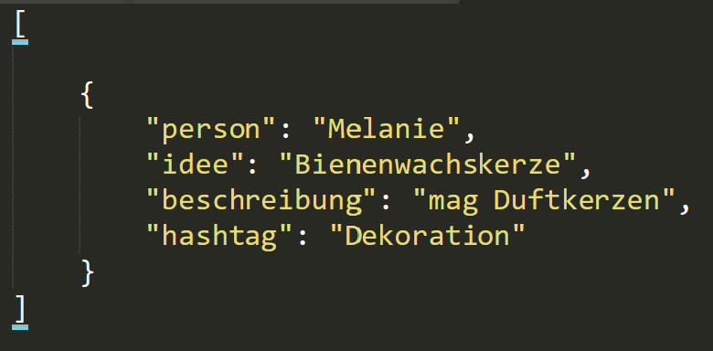
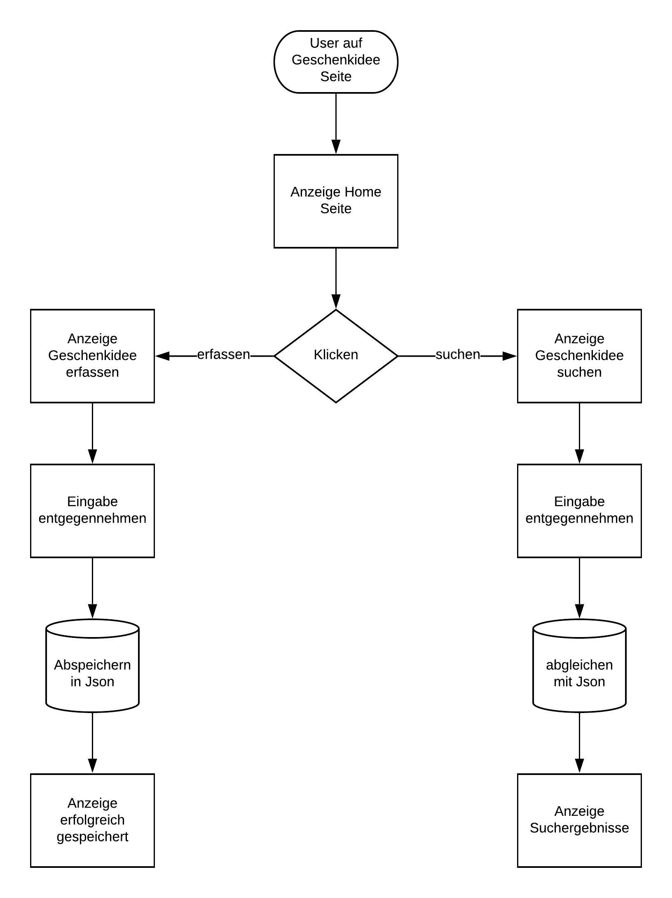

# Projekt Idee
**Geschenkideen speichern**

## Ausgangslage
Ganz oft kommt es vor, dass ich vor Weihnachten oder einem Geburtstag keine Geschenkidee habe. Es wäre deshalb super, während des Jahres mögliche Ideen zu speichern, um diese vor dem Event abrufen zu können.

## Funktion / Projektidee
Die Webapplikation soll Geschenke erfassen und es erlauben, nach diesen zu suchen. Die Suchmöglichkeit soll für den Namen und Hashtags möglich sein.

## Installationsanleitung
Für die korrekte Ausführung der Webapplikation muss Flask und Plotly installiert werden. Danach kann die main.py Datei mit dem Befehl Python main.py gestartet werden.

## Workflow
**Erfassen einer Geschenkidee**
- Erfassen der Person
- Notieren der Geschenkidee
- Hinzufügen einer Beschreibung
- Aufführen eines Hashtags

**Suchen einer Geschenkidee**
- Auswählen einer Person
- Ankreuzen der Hashtags

### Dateneingabe
Einem neuen Eintrag können folgende Merkmale hinzugefügt werden.
- Person
- Geschenkidee
- Beschreibung
- Hashtag

### Datenverarbeitung / Speicherung
Alle Einträge werden mit Json abgespeichert, die Struktur ist hier zu erkennen.

### Datenausgabe
Die gespeicherten Einträge werden aus dem Json ausgelesen und ausgegeben.

### Flussdiagramm

### Datenflussdiagramm

[!Diagramm](./datenflussdiagramm)
